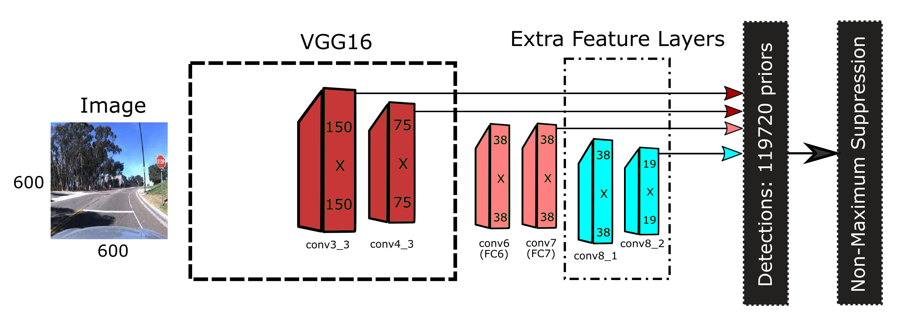
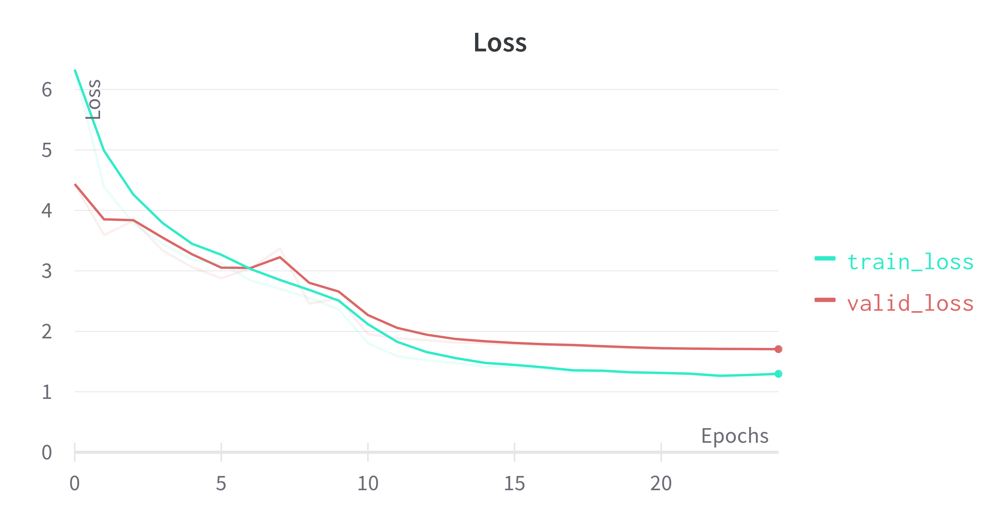
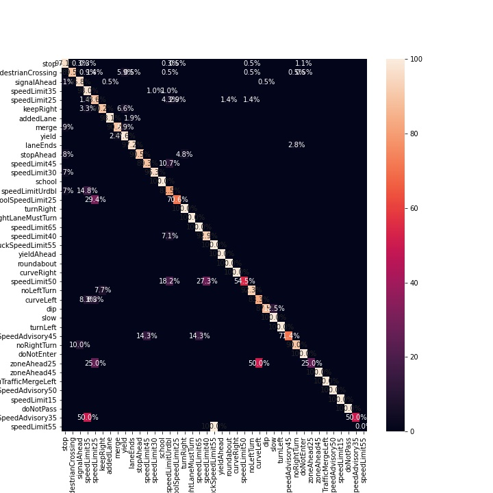
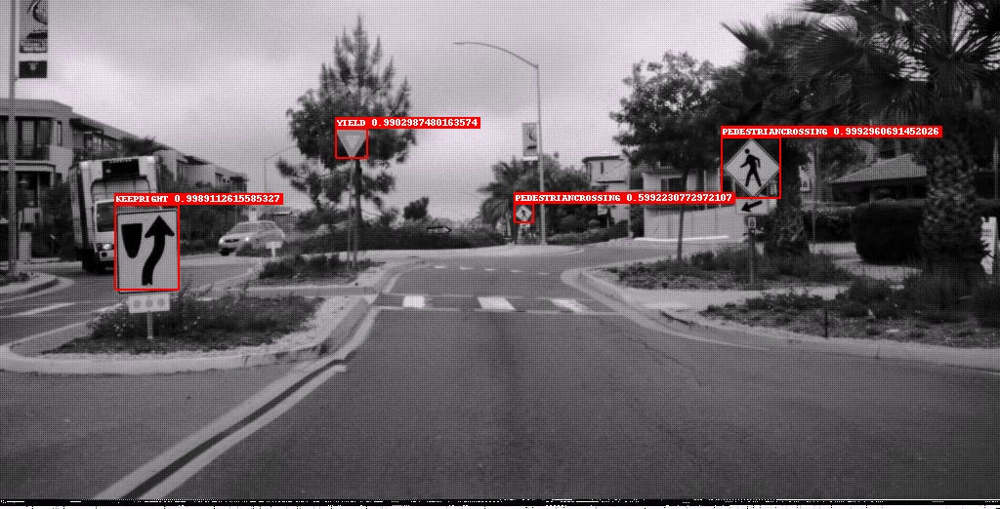

# Traffic Sign Recognition

This repository contains a Deep Learning model designed to detect traffic signs in the LISA traffic sign dataset using a Single Shot Detector (SSD) based architecture.


## Repository Structure

```bash
│   README.md                      # This README file
│	
├───DATASET
│   │
│   │
│   └───Annotations.csv            # Ground truth information containing locations
│                                  # and classes of all traffic signs in each image
│
├───RESOURCES
│   label_map.json                 # A JSON file containing the traffic sign class
│                                  # numbers and corresponding names
│   TEST_images.json               # A JSON file containing the absolute paths of
│                                  # all test image files
│   TEST_objects.json              # A JSON file containing ground truth information
│                                  # containing locations and classes of all traffic
│                                  # signs in the test image
│   checkpoint.pth.tar             # The weights of the trained model 
│   TRAIN_images.json              # A JSON file containing the absolute paths of
│                                  # all training image files
│   TRAIN_objects.json             # A JSON file containing ground truth information
│                                  # containing locations and classes of all traffic
│                                  # signs in the training images
│
├───RESULTS                        # To save the images annotated by the detector with a
│                                  # bounding box, the class name, and the detection
│                                  # score per detection.
│
└───SRC
    vision.py                      # Node to run the model in ROS
    └───utils
        datasets.py                # A code file containing a PyTorch Dataset class for the LISA dataset
        Traffic_Sign.py            # Notebook includes the whole code
        model.py                   # A code file containing the SSD model
        my_eval_sim.ipynb             # A code file to be used in the vision node to return the prediction of the model
        my_evaluation.py           # A code file to evaluate the model on the test set by calculating precision and
                                   # recall, also create the annotated image files located in 'RESULTS'
        train.py                   # A code file to train the model
        utilities.py               # A code file containing several utilities
        data_preprocessing.py      # A code file to prepare the data as explained in the report and to create the test,
                                   # valid and train json files
```

## Requirements:

- Download the full LISA dataset from [Kaggle](https://www.kaggle.com/datasets/omkarnadkarni/lisa-traffic-sign) and place it in the `DATASET` folder.

## Libraries

- Python
- PyTorch
- Pandas
- Pillow

## Running the Code

1. Navigate to the `SRC` directory.
2. Execute `python data_preprocessing.py` to create the JSON files processed by the data loader.
3. Run `python train.py` to train the model. Weights are saved in `RESOURCES/checkpoint.pth.tar`.
4. Execute `python my_evaluation.py` to evaluate the model and create annotated images in the `RESULTS` directory.

### Real-Time Prediction in Gazebo Environment

1. Launch the environment:
   - `roslaunch small_house_world small_house.launch`
   - `roslaunch turtlebot_desktop sim_start.launch`
2. Control the robot:
   - `roslaunch turtlebot_desktop keyboard_teleop.launch`
3. Start real-time prediction:
   - `python vision.py`

## Results and Performance Analysis

### Model Training and Validation

The model was trained on 3,970 examples over 25 epochs, using a stochastic gradient descent (SGD) optimizer with a learning rate that starts at 3e-5 and decays to 3e-6 after 10 epochs. The training and validation losses stabilized over epochs, indicating a good fit and effective learning without memorizing the data. The final training loss was 1.296, slightly lower than the validation loss of 1.705, showing a small generalization gap.



### Precision, Recall, and F1-Score

Precision, recall, and F1 scores were calculated based on a threshold of 0.45 for class scores and a minimum overlap of 0.3 with the ground truth. The model achieved an overall precision of 0.939, recall of 0.911, and F1 score of 0.925.

### Confusion Matrix

The confusion matrix provides a visual summary of the model's performance across different classes, highlighting the most common misclassifications.



### Detection Examples

The model effectively detected traffic signs even under challenging conditions such as small or blurred signs. It also demonstrated the capability to recognize multiple signs within a single image.



### Real-Time Detection in Simulation

Real-time detection was demonstrated in a simulated environment, showing the model's capability to operate effectively in dynamic scenarios.

<p float="left">
  
   
</p>

## Acknowledgements

Portions of the software in this repository utilize copyrighted material which is hereby acknowledged as follows:

**SSD: Single Shot MultiBox Detector | a PyTorch Tutorial to Object Detection**
- **Author**: Sagar Vinodababu
- **Year**: 2019
- **License**: MIT License

**[SSD](https://github.com/marvinruder/ssd)**
- **Author**: Marvin Ruder 

MIT License

Copyright (c) 2019 Sagar Vinodababu

Permission is hereby granted, free of charge, to any person obtaining a copy of this software and associated documentation files (the “Software”), to deal in the Software without restriction, including without limitation the rights to use, copy, modify, merge, publish, distribute, sublicense, and/or sell copies of the Software, and to permit persons to whom the Software is furnished to do so, subject to the following conditions:

The above copyright notice and this permission notice shall be included in all copies or substantial portions of the Software.

THE SOFTWARE IS PROVIDED “AS IS”, WITHOUT WARRANTY OF ANY KIND, EXPRESS OR IMPLIED, INCLUDING BUT NOT LIMITED TO THE WARRANTIES OF MERCHANTABILITY, FITNESS FOR A PARTICULAR PURPOSE AND NONINFRINGEMENT. IN NO EVENT SHALL THE AUTHORS OR COPYRIGHT HOLDERS BE LIABLE FOR ANY CLAIM, DAMAGES OR OTHER LIABILITY, WHETHER IN AN ACTION OF CONTRACT, TORT OR OTHERWISE, ARISING FROM, OUT OF OR IN CONNECTION WITH THE SOFTWARE OR THE USE OR OTHER DEALINGS IN THE SOFTWARE.


